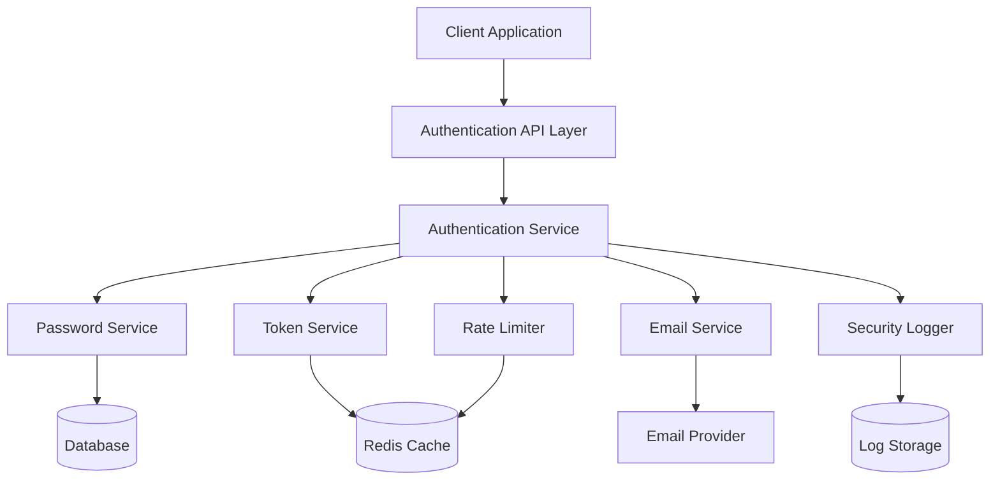

# Secure Authentication System Design

## Overview

This design document outlines the implementation of a comprehensive secure authentication system for the SolarConnect platform. The system will replace the current insecure demo authentication with industry-standard security practices, including secure password hashing, email verification, password reset functionality, account lockout mechanisms, and comprehensive security logging.

The design follows security-first principles with defense in depth, implementing multiple layers of protection against common attack vectors including brute force attacks, timing attacks, and credential stuffing.

## Architecture

### High-Level Architecture



### Security Layers

1. **Transport Security**: HTTPS enforcement for all authentication endpoints
2. **Rate Limiting**: Request throttling to prevent brute force attacks
3. **Input Validation**: Comprehensive validation of all user inputs
4. **Password Security**: Bcrypt hashing with high salt rounds
5. **Session Management**: Secure session handling with proper invalidation
6. **Audit Logging**: Comprehensive logging of all security events

## Components and Interfaces

### Authentication Service

**Purpose**: Central orchestrator for all authentication operations

**Key Methods**:
- `register(email, password, confirmPassword)`: User registration with validation
- `login(email, password)`: User authentication with security checks
- `logout(sessionId)`: Secure session termination
- `verifyEmail(token)`: Email verification processing
- `requestPasswordReset(email)`: Password reset initiation
- `resetPassword(token, newPassword)`: Password reset completion
- `changePassword(userId, currentPassword, newPassword)`: Password change for authenticated users

**Security Features**:
- Account lockout after failed attempts
- Timing attack protection
- Session management
- Security event logging

### Password Service

**Purpose**: Secure password operations and validation

**Key Methods**:
- `hashPassword(password)`: Bcrypt hashing with salt rounds ≥ 12
- `verifyPassword(password, hash)`: Secure password verification
- `validatePasswordStrength(password)`: Password policy enforcement
- `generateSecureToken()`: Cryptographically secure token generation

**Password Policy**:
- Minimum 8 characters
- At least one uppercase letter
- At least one lowercase letter
- At least one number
- At least one special character
- No common passwords or dictionary words

### Token Service

**Purpose**: Secure token generation and validation for various operations

**Key Methods**:
- `generateEmailVerificationToken(userId)`: Email verification tokens
- `generatePasswordResetToken(userId)`: Password reset tokens
- `validateToken(token, type)`: Token validation with expiry checks
- `invalidateToken(token)`: Token revocation
- `cleanupExpiredTokens()`: Maintenance operations

**Token Specifications**:
- Email verification: 24-hour expiry
- Password reset: 1-hour expiry
- Cryptographically secure random generation
- Single-use tokens with automatic invalidation

### Email Service

**Purpose**: Secure email communications for authentication flows

**Key Methods**:
- `sendVerificationEmail(email, token)`: Account verification emails
- `sendPasswordResetEmail(email, token)`: Password reset emails
- `sendPasswordChangeNotification(email)`: Security notifications
- `sendSecurityAlert(email, event)`: Security incident notifications

**Email Security**:
- Template-based emails to prevent injection
- Rate limiting on email sending
- Secure token embedding in URLs
- Professional email templates with clear instructions

### Security Logger

**Purpose**: Comprehensive audit trail for security events

**Key Methods**:
- `logAuthenticationAttempt(email, success, ip, userAgent)`: Login attempts
- `logPasswordChange(userId, ip)`: Password modifications
- `logAccountLockout(email, reason, duration)`: Security lockouts
- `logSuspiciousActivity(userId, event, details)`: Threat detection
- `generateSecurityReport(timeRange, filters)`: Administrative reporting

**Logged Events**:
- All login attempts (success/failure)
- Password changes and resets
- Email verification events
- Account lockouts and unlocks
- Token generation and usage
- Administrative actions

### Rate Limiter

**Purpose**: Protection against brute force and DoS attacks

**Implementation**:
- Redis-based sliding window rate limiting
- Multiple rate limit tiers:
  - Login attempts: 5 per 15 minutes per IP
  - Registration: 3 per hour per IP
  - Password reset: 3 per hour per email
  - Email verification: 5 per hour per email

## Data Models

### User Model Extensions

```typescript
interface User {
  id: string;
  email: string;
  passwordHash: string;
  emailVerified: boolean;
  emailVerificationToken?: string;
  emailVerificationExpiry?: Date;
  passwordResetToken?: string;
  passwordResetExpiry?: Date;
  failedLoginAttempts: number;
  accountLockedUntil?: Date;
  lastLoginAt?: Date;
  lastLoginIP?: string;
  createdAt: Date;
  updatedAt: Date;
}
```

### Security Event Model

```typescript
interface SecurityEvent {
  id: string;
  userId?: string;
  email?: string;
  eventType: SecurityEventType;
  success: boolean;
  ipAddress: string;
  userAgent: string;
  details?: Record<string, any>;
  timestamp: Date;
}

enum SecurityEventType {
  LOGIN_ATTEMPT = 'login_attempt',
  REGISTRATION = 'registration',
  PASSWORD_CHANGE = 'password_change',
  PASSWORD_RESET_REQUEST = 'password_reset_request',
  PASSWORD_RESET_COMPLETE = 'password_reset_complete',
  EMAIL_VERIFICATION = 'email_verification',
  ACCOUNT_LOCKOUT = 'account_lockout',
  SUSPICIOUS_ACTIVITY = 'suspicious_activity'
}
```

### Session Model

```typescript
interface Session {
  id: string;
  userId: string;
  token: string;
  expiresAt: Date;
  ipAddress: string;
  userAgent: string;
  createdAt: Date;
  lastAccessedAt: Date;
}
```

## Error Handling

### Security-First Error Handling

**Principle**: Never reveal information that could aid attackers

**Error Categories**:

1. **Authentication Errors**: Generic "Invalid credentials" message for all login failures
2. **Registration Errors**: Specific validation errors for user experience
3. **Rate Limiting Errors**: Clear messaging about temporary restrictions
4. **System Errors**: Generic error messages with detailed logging

**Error Response Format**:
```typescript
interface AuthError {
  code: string;
  message: string;
  field?: string; // Only for validation errors
  retryAfter?: number; // For rate limiting
}
```

### Account Lockout Strategy

**Lockout Triggers**:
- 5 failed login attempts within 15 minutes
- Suspicious activity patterns
- Multiple password reset requests

**Lockout Duration**:
- First lockout: 30 minutes
- Subsequent lockouts: Exponential backoff (1 hour, 4 hours, 24 hours)
- Administrative unlock available

**Lockout Communication**:
- Clear messaging about lockout reason and duration
- Email notification to account owner
- Administrative alerts for repeated lockouts

## Testing Strategy

### Unit Testing

**Password Service Tests**:
- Password hashing and verification
- Password strength validation
- Timing attack resistance
- Salt uniqueness verification

**Token Service Tests**:
- Token generation randomness
- Expiry validation
- Single-use enforcement
- Cleanup operations

**Authentication Service Tests**:
- Registration flow validation
- Login success/failure scenarios
- Account lockout mechanisms
- Password reset workflows

### Integration Testing

**End-to-End Authentication Flows**:
- Complete registration and verification
- Login with various scenarios
- Password reset workflows
- Account lockout and recovery

**Security Testing**:
- Brute force attack simulation
- Timing attack testing
- Rate limiting validation
- Session security verification

### Performance Testing

**Load Testing Scenarios**:
- Concurrent login attempts
- Password hashing performance under load
- Rate limiter effectiveness
- Database query optimization

**Benchmarks**:
- Login response time < 500ms
- Registration completion < 1s
- Password reset email delivery < 30s
- Rate limiter response < 50ms

## Security Considerations

### Password Security

**Hashing Strategy**:
- Bcrypt with minimum 12 salt rounds
- Unique salt per password
- Regular review of salt round adequacy
- Migration strategy for hash upgrades

**Password Policy Enforcement**:
- Client-side validation for UX
- Server-side validation for security
- Password strength meter
- Common password blacklist

### Token Security

**Generation**:
- Cryptographically secure random number generator
- Sufficient entropy (256-bit minimum)
- No predictable patterns
- Secure storage in database

**Validation**:
- Constant-time comparison
- Expiry enforcement
- Single-use validation
- Secure cleanup of expired tokens

### Session Security

**Session Management**:
- Secure session token generation
- HttpOnly and Secure cookie flags
- Session expiry and renewal
- Concurrent session limits

**Session Invalidation**:
- Logout invalidation
- Password change invalidation
- Administrative revocation
- Automatic cleanup of expired sessions

### Monitoring and Alerting

**Real-time Monitoring**:
- Failed login attempt spikes
- Account lockout patterns
- Unusual geographic access
- Token usage anomalies

**Alert Thresholds**:
- >100 failed logins per hour
- >10 account lockouts per hour
- Password reset spike detection
- Suspicious IP activity

## Implementation Phases

### Phase 1: Core Authentication (Week 1-2)
- Password service implementation
- Basic registration and login
- Database schema updates
- Unit test coverage

### Phase 2: Security Features (Week 3-4)
- Rate limiting implementation
- Account lockout mechanisms
- Security logging
- Email verification

### Phase 3: Password Management (Week 5-6)
- Password reset functionality
- Password change features
- Email notifications
- Security monitoring

### Phase 4: Advanced Security (Week 7-8)
- Comprehensive audit logging
- Administrative security dashboard
- Performance optimization
- Security testing and validation

## Migration Strategy

### Database Migration

**User Table Updates**:
- Add new security-related columns
- Migrate existing demo passwords to secure hashes
- Create indexes for performance
- Backup strategy for rollback

**Data Migration Steps**:
1. Add new columns with default values
2. Hash existing passwords (if any real data exists)
3. Update application code to use new fields
4. Remove old insecure authentication code
5. Verify migration success

### Deployment Strategy

**Rolling Deployment**:
- Feature flags for gradual rollout
- A/B testing for critical flows
- Monitoring during deployment
- Rollback procedures

**Compatibility**:
- Backward compatibility during transition
- Graceful degradation for old sessions
- Clear migration timeline
- User communication strategy